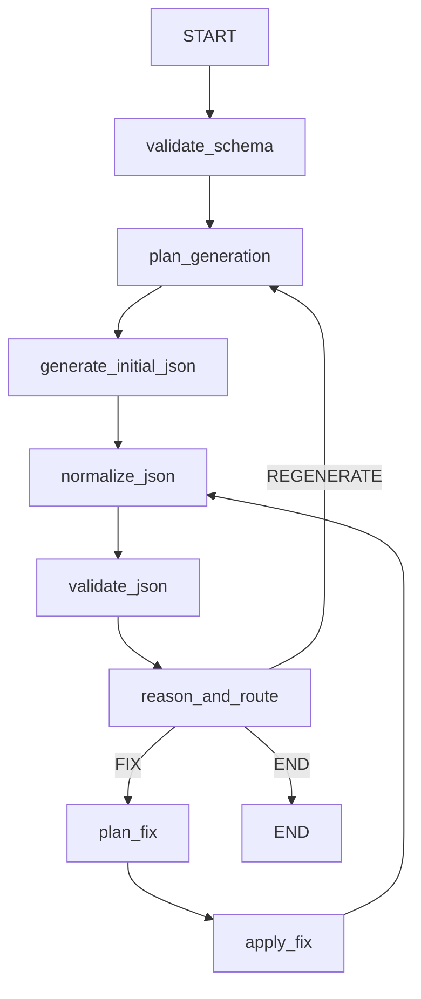

# ai-test-data-generation
Test data generation with schemas and additional context

# Agent Flow

**Quick Start**
- Run: `mvn -DskipTests package` then `java -jar target/*.jar`.
- Default profile: `gigachat-openrouter` (thinking via OpenRouter, generation via GigaChat).
- Override profile: set `SPRING_PROFILES_ACTIVE` to `gigachat-only`, `gigachat-openrouter`, or `openrouter-only`.

**Profiles**
- `gigachat-only`: все ноды/тулы используют GigaChat.
- `gigachat-openrouter` (по умолчанию): мышление/валидация/маршрутизация → OpenRouter; генерация/фикс → GigaChat.
- `openrouter-only`: все ноды/тулы используют OpenRouter.

**Model Routing Per Node**
- YAML key: `ai.model-routing.nodes` maps simple class name → model string.
- Family selection:
  - GigaChat model (содержит `GigaChat`) → клиент GigaChat.
  - OpenRouter style (`provider/model` или `:`) → клиент OpenRouter.
- File: `src/main/resources/application.yml` (overridable via env):
  - `ai.model-routing.nodes.ReasonAndRouteNode: ${AI_ROUTE_REASON_MODEL:deepseek/deepseek-r1}`
  - `ai.model-routing.nodes.ValidateJsonSchemaNode: ${AI_ROUTE_VALIDATE_SCHEMA_MODEL:deepseek/deepseek-r1}`
  - `ai.model-routing.nodes.VerifyJsonByJsonSchemaNode: ${AI_ROUTE_VALIDATE_JSON_MODEL:deepseek/deepseek-r1}`
  - `ai.model-routing.nodes.ThinkHowToGenerateTool: ${AI_ROUTE_THINK_GEN_MODEL:deepseek/deepseek-r1}`
  - `ai.model-routing.nodes.ThinkHowToFixJsonTool: ${AI_ROUTE_THINK_FIX_MODEL:deepseek/deepseek-r1}`
  - `ai.model-routing.nodes.GenerateJsonBySchemaTool: ${AI_ROUTE_GENERATE_MODEL:GigaChat-2-Max}`
  - `ai.model-routing.nodes.FixValidationErrorsInJsonTool: ${AI_ROUTE_FIX_MODEL:GigaChat-2-Max}`

**Provider Config (YAML/ENV)**
- `OpenRouter` (Spring AI OpenAI starter):
  - `spring.ai.openai.base-url`: `${OPENROUTER_BASE_URL:https://openrouter.ai/api/v1}`
  - `spring.ai.openai.api-key`: `${OPENROUTER_API_KEY}`
  - `spring.ai.openai.chat.options.model`: `${OPENROUTER_MODEL:deepseek/deepseek-r1}`
  - `spring.ai.openai.chat.options.temperature`: `${OPENROUTER_TEMPERATURE:0.2}`
  - `spring.ai.openai.chat.options.max-tokens`: `${OPENROUTER_MAX_TOKENS:2000}`
- `GigaChat`:
  - `spring.ai.gigachat.scope`: `${SPRING_AI_GIGACHAT_SCOPE:GIGACHAT_API_CORP}`
  - `spring.ai.gigachat.client-id`: `${SPRING_AI_GIGACHAT_CLIENT_ID}`
  - `spring.ai.gigachat.client-secret`: `${SPRING_AI_GIGACHAT_CLIENT_SECRET}`
  - `spring.ai.gigachat.chat.options.model`: `${SPRING_AI_GIGACHAT_MODEL:GigaChat-2-Max}`
  - `spring.ai.gigachat.chat.options.temperature`: `${SPRING_AI_GIGACHAT_TEMPERATURE:0.3}`
  - `spring.ai.gigachat.chat.options.top-p`: `${SPRING_AI_GIGACHAT_TOP_P:0.95}`
  - `spring.ai.gigachat.chat.options.max-tokens`: `${SPRING_AI_GIGACHAT_MAX_TOKENS:1500}`

**Run Examples**
- Default mix: `java -jar target/*.jar`
- Only GigaChat: `SPRING_PROFILES_ACTIVE=gigachat-only java -jar target/*.jar`
- Only OpenRouter: `SPRING_PROFILES_ACTIVE=openrouter-only OPENROUTER_API_KEY=... java -jar target/*.jar`

**Formatting**
- Check: `mvn -q -DskipTests verify` (Spotless runs in verify).
- Apply: `mvn spotless:apply`.

**Troubleshooting**
- Bean ambiguity on startup: ensure one of profiles is active (default is `gigachat-openrouter`).
- Missing credentials: set `OPENROUTER_API_KEY` and/or `SPRING_AI_GIGACHAT_CLIENT_*` env vars.
