# AI Test Data Generation Agent 🛟

[](https://github.com/ai-qa-solutions/ai-test-data-generation/blob/main/README.md)
[](https://github.com/ai-qa-solutions/ai-test-data-generation/blob/main/README.ru.md)

An intelligent multi-agent system for generating realistic, schema-compliant JSON test data using LangGraph4j workflow
engine and multiple AI models.

## 🎯 Why This Agent?

Testing modern applications requires realistic, diverse test data that strictly adheres to JSON schemas. Manual creation
is time-consuming and often results in placeholder-heavy, unrealistic datasets. This agent solves these problems by:

- **🧠 Intelligent Generation**: Uses AI to create realistic, locale-aware test data
- **📋 Schema Compliance**: Strict validation against JSON Schema (Draft 4/6/7/2019-09/2020-12)
- **🔄 Self-Healing**: Automatically detects and fixes validation errors
- **🚫 Anti-Placeholder Policy**: Actively avoids fake data like "John Doe", "123-456", "test@example.com"
- **🌍 Locale-Aware**: Generates realistic Russian names, addresses, phone numbers, tax IDs
- **🎛️ Multi-Model**: Routes different tasks to optimal AI models (generation vs validation)

## 🔄 Workflow

The agent follows an intelligent workflow with decision-making and error recovery:

```mermaid
graph TD
    START([🚀 START]) --> validate_schema[📋 Validate JSON Schema]
    validate_schema --> plan_generation[🧠 Plan Generation Strategy]
    plan_generation --> generate_initial_json[⚡ Generate Initial JSON]
    generate_initial_json --> normalize_json[🧹 Normalize & Clean JSON]
    normalize_json --> validate_json[🔍 Validate Against Schema]
    validate_json --> reason_and_route{🤔 Analyze Results}
    
    reason_and_route -->|✅ Valid| END([🎉 Return Final JSON])
    reason_and_route -->|⚠️ Few Errors ≤2| plan_fix[🛠️ Plan Targeted Fixes]
    reason_and_route -->|❌ Many Errors| plan_generation
    
    plan_fix --> apply_fix[🔧 Apply Fixes]
    apply_fix --> normalize_json
    
    style START fill:#1f2937,stroke:#3b82f6,stroke-width:2px,color:#ffffff
    style END fill:#059669,stroke:#10b981,stroke-width:2px,color:#ffffff
    style reason_and_route fill:#f59e0b,stroke:#f97316,stroke-width:2px,color:#000000
    style validate_schema fill:#8b5cf6,stroke:#a855f7,stroke-width:2px,color:#ffffff
    style plan_generation fill:#059669,stroke:#10b981,stroke-width:2px,color:#ffffff
    style generate_initial_json fill:#0ea5e9,stroke:#0284c7,stroke-width:2px,color:#ffffff
    style normalize_json fill:#eab308,stroke:#ca8a04,stroke-width:2px,color:#000000
    style validate_json fill:#8b5cf6,stroke:#a855f7,stroke-width:2px,color:#ffffff
    style plan_fix fill:#dc2626,stroke:#b91c1c,stroke-width:2px,color:#ffffff
    style apply_fix fill:#dc2626,stroke:#b91c1c,stroke-width:2px,color:#ffffff
```



## 🚀 Quick Start

### Prerequisites

- Java 17+
- Spring Boot 3.x
- Access to AI models (GigaChat and/or OpenRouter)

### Environment Configuration

```bash
# Spring Profile (choose one)
SPRING_PROFILES_ACTIVE=gigachat-openrouter  # Recommended: hybrid approach
# SPRING_PROFILES_ACTIVE=gigachat-only      # All tasks via GigaChat
# SPRING_PROFILES_ACTIVE=openrouter-only    # All tasks via OpenRouter

# GigaChat Configuration (if using gigachat profiles)
SPRING_AI_GIGACHAT_CHAT_ENABLED=true
SPRING_AI_GIGACHAT_CHAT_OPTIONS_MODEL=GigaChat-Pro
SPRING_AI_GIGACHAT_CHAT_AUTHORIZATION_TYPE=Bearer
SPRING_AI_GIGACHAT_CHAT_TOKEN=your_gigachat_token

# OpenRouter Configuration (if using openrouter profiles)
SPRING_AI_OPENAI_CHAT_ENABLED=true
SPRING_AI_OPENAI_BASE_URL=https://openrouter.ai/api/v1
SPRING_AI_OPENAI_CHAT_OPTIONS_MODEL=anthropic/claude-3.5-sonnet
SPRING_AI_OPENAI_API_KEY=your_openrouter_api_key

# Optional: Node-specific model routing
AI_MODEL_ROUTING_NODES_GENERATEJSONNODE=GigaChat-Pro
AI_MODEL_ROUTING_NODES_THINKHOWTOGENERATETOOL=anthropic/claude-3.5-sonnet
```

### Running the Application

```bash
# Using Maven
./mvn spring-boot:run

# Using JAR
java -jar target/ai-test-data-generation-agent.jar

# Using Docker
docker run -p 8080:8080 \
  -e SPRING_PROFILES_ACTIVE=gigachat-openrouter \
  -e SPRING_AI_GIGACHAT_CHAT_TOKEN=your_token \
  -e SPRING_AI_OPENAI_API_KEY=your_key \
  your-image:latest
```

## 📡 Usage

### LangGraph4j Studio Interface

The primary interface is the **LangGraph4j Studio** web interface available at `http://localhost:8080` after starting
the application.

#### Studio Features:

- 🎨 **Visual Workflow Editor**: Interactive graph visualization
- 🔍 **Real-time Monitoring**: Watch the agent flow execution step-by-step
- 📊 **State Inspection**: View agent state at each workflow node
- 🛠️ **Interactive Testing**: Input JSON schemas and prompts directly
- 📈 **Performance Metrics**: Execution times, model routing decisions
- 🐛 **Debug Mode**: Detailed logging and error analysis

#### Using the Studio:

1. **Navigate to** `http://localhost:8080`
2. **Select the flow**: "(AITDG) AI Test Data Generation 🛟"
3. **Configure inputs**:
    - `USER_PROMPT`: "Generate data for a Saint Petersburg resident passport"
    - `JSON_SCHEMA`: Paste your JSON schema
4. **Execute**: Click "Run" and watch the workflow execution
5. **Inspect results**: View generated JSON and execution metadata

#### Example Input in Studio:

**USER_PROMPT:**

```
Generate realistic data for a Russian passport holder from Saint Petersburg
```

**JSON_SCHEMA:**

```json
{
  "type": "object",
  "properties": {
    "passport_rf": {
      "type": "object",
      "properties": {
        "series": {
          "type": "string",
          "pattern": "^\\d{2} \\d{2}$"
        },
        "number": {
          "type": "string",
          "pattern": "^\\d{6}$"
        },
        "unit_code": {
          "type": "string",
          "pattern": "^\\d{3}-\\d{3}$"
        }
      },
      "required": [
        "series",
        "number",
        "unit_code"
      ]
    },
    "fio": {
      "type": "string",
      "minLength": 1
    }
  },
  "required": [
    "passport_rf",
    "fio"
  ]
}
```

#### Expected Output:

```json
{
  "passport_rf": {
    "series": "40 17",
    "number": "685294",
    "unit_code": "780-047"
  },
  "fio": "Морозова Анна Владимировна"
}
```

### Programmatic Access

For integration with other systems, you can also invoke the workflow programmatically through the LangGraph4j Java API (
see Development section).

## ⚙️ Configuration

### Spring Profiles

| Profile               | Description                                                                                                 | Use Case                                                       |
|-----------------------|-------------------------------------------------------------------------------------------------------------|----------------------------------------------------------------|
| `gigachat-openrouter` | **CIS/Russian-focused**: GigaChat-2-Pro for generation, OpenRouter models (e.g., DeepSeek-R1) for reasoning | Optimal for CIS region test data with cost-effective reasoning |
| `gigachat-only`       | All tasks via GigaChat-2-Pro/Max                                                                            | Pure Russian deployment, best CIS locale understanding         |
| `openrouter-only`     | All tasks via OpenRouter models                                                                             | International deployments, non-CIS test data generation        |

### Model Routing

Fine-tune which models handle specific tasks based on regional context:

```yaml
ai:
  model-routing:
    nodes:
      # CIS-focused generation with GigaChat-2-Pro
      GenerateJsonNode: "GigaChat-2-Pro"
      FixValidationErrorsInJsonTool: "GigaChat-2-Pro"

      # Cost-effective reasoning with free DeepSeek-R1
      ThinkHowToGenerateTool: "deepseek/deepseek-r1"
      ReasonAndRouteNode: "deepseek/deepseek-r1"

      # Alternative options
      # ThinkHowToGenerateTool: "anthropic/claude-4.1-sonnet"
      # ReasonAndRouteNode: "anthropic/claude-4.1-sonnet"
```

### Environment Variables

#### Core Configuration

```bash
# Application
SERVER_PORT=8080
LOGGING_LEVEL_GITHUB_AI_QA_SOLUTIONS=INFO

# Spring Boot
SPRING_PROFILES_ACTIVE=gigachat-openrouter
SPRING_APPLICATION_NAME=ai-test-data-generation-agent
```

#### GigaChat Settings

```bash
SPRING_AI_GIGACHAT_CHAT_ENABLED=true
SPRING_AI_GIGACHAT_CHAT_TOKEN=your_gigachat_api_token
SPRING_AI_GIGACHAT_CHAT_OPTIONS_MODEL=GigaChat-2-Pro  # or GigaChat-2-Max
SPRING_AI_GIGACHAT_CHAT_OPTIONS_TEMPERATURE=0.1
SPRING_AI_GIGACHAT_CHAT_OPTIONS_MAX_TOKENS=4000
SPRING_AI_GIGACHAT_CHAT_AUTHORIZATION_TYPE=Bearer
```

#### OpenRouter Settings

```bash
SPRING_AI_OPENAI_CHAT_ENABLED=true
SPRING_AI_OPENAI_API_KEY=sk-or-v1-your-openrouter-key
SPRING_AI_OPENAI_BASE_URL=https://openrouter.ai/api/v1
# Free models for cost-effective reasoning
SPRING_AI_OPENAI_CHAT_OPTIONS_MODEL=deepseek/deepseek-r1
# Premium alternatives: anthropic/claude-3.5-sonnet, openai/gpt-4
SPRING_AI_OPENAI_CHAT_OPTIONS_TEMPERATURE=0.1
SPRING_AI_OPENAI_CHAT_OPTIONS_MAX_TOKENS=4000
```

## 🏗️ Architecture

### Multi-Agent System

The system uses **LangGraph4j** to orchestrate multiple specialized agents:

- **Schema Validator**: Validates JSON Schema compatibility
- **Generation Planner**: Creates data generation strategies
- **JSON Generator**: Produces initial schema-compliant data
- **Normalizer**: Cleans and standardizes output
- **Validator**: Strict schema compliance checking
- **Decision Router**: Intelligent next-step determination
- **Fix Planner**: Analyzes validation errors
- **Error Fixer**: Applies targeted corrections

### Smart Model Routing

Different AI models excel at different tasks and regional contexts:

| Task Type                 | CIS/Russian Context | International Context | Reasoning                                     |
|---------------------------|---------------------|-----------------------|-----------------------------------------------|
| **JSON Generation**       | GigaChat-2-Pro/Max  | Claude-3.5-Sonnet     | GigaChat excels at CIS-specific data patterns |
| **Validation & Analysis** | DeepSeek-R1 (free)  | Claude-3.5-Sonnet     | Cost-effective reasoning vs premium analysis  |
| **Planning & Strategy**   | DeepSeek-R1 (free)  | Claude-3.5-Sonnet     | Multi-step planning capabilities              |
| **Decision Making**       | DeepSeek-R1 (free)  | GPT-4                 | Binary decisions and routing logic            |

**Cost Optimization**: The `gigachat-openrouter` profile combines:

- **GigaChat-2-Pro**: Superior CIS locale understanding for data generation
- **DeepSeek-R1**: Free, high-quality reasoning for validation and planning

### Anti-Placeholder System

The agent actively detects and avoids placeholder-like data:

- **Numeric patterns**: `123456`, `000000`, `111111`
- **Sequential runs**: `0123456789`, `987654321`
- **Common fakes**: `John Doe`, `Иванов Иван Иванович`
- **Test emails**: `test@example.com`, `demo@localhost`
- **Dummy phones**: `123-456-7890`, `555-0123`

### State Management

The `AgentState` tracks the complete workflow context:

```java
public enum StateKey {
    USER_PROMPT,              // Original request
    JSON_SCHEMA,              // Target schema
    GENERATED_JSON,           // Current JSON data
    VALIDATION_RESULT,        // Validation outcome
    VALIDATION_SIGNATURE,     // Error fingerprint
    PLAN_GENERATION,          // Generation strategy
    PLAN_FIX,                // Error fixing plan
    DECISION,                // Next action
    REASONING,               // Decision rationale
    ITERATION                // Attempt counter
}
```

## 🔧 Advanced Features

### Schema Version Detection

Automatically detects and handles multiple JSON Schema versions:

- Draft 4 (default fallback)
- Draft 6
- Draft 7
- Draft 2019-09
- Draft 2020-12

### Locale-Aware Generation

**For CIS/Russian contexts** (best with `gigachat-openrouter` or `gigachat-only`):

- **Names**: Proper Russian surnames, given names, patronymics
- **Addresses**: Real Russian cities, streets, postal codes
- **Phone Numbers**: Valid Russian mobile formats (+7 9XX XXX-XX-XX)
- **Tax IDs**: Valid INN/OGRN/SNILS checksums
- **Unit Codes**: Regional department codes (780-XXX for SPb)

**For International contexts** (best with `openrouter-only`):

- **Names**: Diverse international name patterns
- **Addresses**: Global address formats and postal systems
- **Phone Numbers**: International dialing formats
- **IDs**: Country-specific identification numbers
- **Postal Codes**: Regional postal code patterns

### Error Recovery

Intelligent error handling with multiple strategies:

1. **Targeted Fixes**: For 1-2 validation errors
2. **Complete Regeneration**: For structural issues
3. **Iterative Improvement**: Tracks progress between attempts
4. **Cycle Prevention**: Detects stuck states via error signatures

## 📊 Monitoring & Observability

### Logging

```bash
# Enable detailed workflow logging
LOGGING_LEVEL_GITHUB_AI_QA_SOLUTIONS=DEBUG

# Monitor specific components
LOGGING_LEVEL_GITHUB_AI_QA_SOLUTIONS_NODES=INFO
LOGGING_LEVEL_GITHUB_AI_QA_SOLUTIONS_TOOLS=INFO
LOGGING_LEVEL_GITHUB_AI_QA_SOLUTIONS_SERVICES=INFO
```

### Health Checks

```bash
# Application health
curl http://localhost:8080/actuator/health

# LangGraph4j Studio health  
curl http://localhost:8080/studio/health

# AI model connectivity (if actuator endpoints are configured)
curl http://localhost:8080/actuator/health/gigachat
curl http://localhost:8080/actuator/health/openrouter
```

## 🐳 Docker Deployment

### Dockerfile

```dockerfile
FROM openjdk:17-jre-slim

COPY target/ai-test-data-generation-agent.jar app.jar

EXPOSE 8080

ENTRYPOINT ["java", "-jar", "/app.jar"]
```

### Docker Compose

```yaml
version: '3.8'
services:
  ai-test-data-agent:
    build: .
    ports:
      - "8080:8080"
    environment:
      - SPRING_PROFILES_ACTIVE=gigachat-openrouter
      - SPRING_AI_GIGACHAT_CHAT_TOKEN=${GIGACHAT_TOKEN}
      - SPRING_AI_OPENAI_API_KEY=${OPENROUTER_KEY}
    healthcheck:
      test: [ "CMD", "curl", "-f", "http://localhost:8080/actuator/health" ]
      interval: 30s
      timeout: 10s
      retries: 3
```

## 🔒 Security Considerations

- **API Keys**: Store in environment variables, never in code
- **Rate Limiting**: Implement to prevent AI model abuse
- **Input Validation**: Sanitize JSON schemas and prompts
- **Output Filtering**: Ensure no sensitive data in generated content
- **Audit Logging**: Track all generation requests and outcomes

## 🛠️ Development

### Building

```bash
# Compile and test
./mvn clean verify

# Skip tests for faster builds  
./mvn clean package -DskipTests

# Build Docker image
docker build -t ai-test-data-agent .
```

### Testing

```bash
# Unit tests
./mvn test

# Integration tests with LangGraph4j Studio
./mvn verify -Pintegration-tests

# Load testing via Studio interface
./mvn verify -Pload-tests
```

### Programmatic Usage

```java

@Autowired
private StateGraph<AgentState> stateGraph;

public String generateTestData(String userPrompt, String jsonSchema) {
    var initialState = new AgentState(Map.of(
            USER_PROMPT.name(), userPrompt,
            JSON_SCHEMA.name(), jsonSchema
    ));

    var result = stateGraph.invoke(initialState);
    return result.get(GENERATED_JSON);
}
```

## 📝 License

This project is licensed under the MIT License - see the [LICENSE](LICENSE) file for details.

## 🤝 Contributing

1. Fork the repository
2. Create a feature branch (`git checkout -b feature/amazing-feature`)
3. Commit your changes (`git commit -m 'Add amazing feature'`)
4. Push to the branch (`git push origin feature/amazing-feature`)
5. Open a Pull Request

## 📞 Ask about something & contribute

- **Issues**: [GitHub Issues](https://github.com/your-org/ai-test-data-generation-agent/issues)
- **Discussions**: [GitHub Discussions](https://github.com/your-org/ai-test-data-generation-agent/discussions)
- **Documentation**: [Wiki](https://github.com/your-org/ai-test-data-generation-agent/wiki)

---

**Built with ❤️ using Spring Boot 3.x, LangGraph4j, and AI magic** ✨