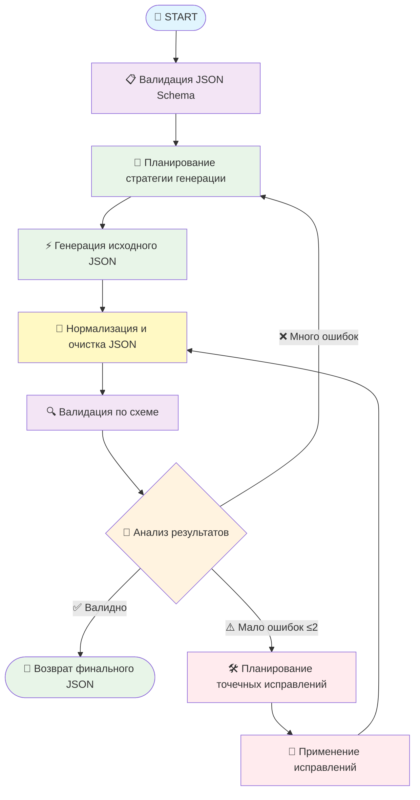

# Агент для генерации тестовых данных на основе ИИ 🛟

[](https://github.com/ai-qa-solutions/ai-test-data-generation/blob/main/README.md)
[](https://github.com/ai-qa-solutions/ai-test-data-generation/blob/main/README.ru.md)

Интеллектуальная мульти-агентная система для генерации реалистичных JSON тестовых данных, соответствующих схемам, с
использованием LangGraph4j и нескольких AI моделей.

## 🎯 Зачем нужен этот агент?

Тестирование современных приложений требует реалистичных, разнообразных тестовых данных, строго соответствующих JSON
схемам. Ручное создание отнимает много времени и часто приводит к нереалистичным наборам данных, полным заглушек. Этот
агент решает эти проблемы:

- **🧠 Умная генерация**: Использует ИИ для создания реалистичных данных с учетом локали
- **📋 Соответствие схемам**: Строгая валидация по JSON Schema (Draft 4/6/7/2019-09/2020-12)
- **🔄 Самовосстановление**: Автоматически обнаруживает и исправляет ошибки валидации
- **🚫 Политика против заглушек**: Активно избегает фейковых данных как "Иванов Иван Иванович", "123-456"
- **🌍 Локализация**: Генерирует реалистичные русские имена, адреса, телефоны, ИНН
- **🎛️ Мульти-модель**: Направляет разные задачи к оптимальным AI моделям

## 🔄 Схема работы

Агент следует интеллектуальному workflow с принятием решений и восстановлением после ошибок:



## 🚀 Быстрый старт

### Предварительные требования

- Java 17+
- Spring Boot 3.x
- Доступ к AI моделям (GigaChat и/или OpenRouter)

### Настройка окружения

```bash
# Spring Profile (выберите один)
SPRING_PROFILES_ACTIVE=gigachat-openrouter  # Рекомендуется: гибридный подход
# SPRING_PROFILES_ACTIVE=gigachat-only      # Все задачи через GigaChat
# SPRING_PROFILES_ACTIVE=openrouter-only    # Все задачи через OpenRouter

# Настройка GigaChat (если используете gigachat профили)
SPRING_AI_GIGACHAT_CHAT_ENABLED=true
SPRING_AI_GIGACHAT_CHAT_OPTIONS_MODEL=GigaChat-Pro
SPRING_AI_GIGACHAT_CHAT_AUTHORIZATION_TYPE=Bearer
SPRING_AI_GIGACHAT_CHAT_TOKEN=ваш_токен_gigachat

# Настройка OpenRouter (если используете openrouter профили)
SPRING_AI_OPENAI_CHAT_ENABLED=true
SPRING_AI_OPENAI_BASE_URL=https://openrouter.ai/api/v1
SPRING_AI_OPENAI_CHAT_OPTIONS_MODEL=anthropic/claude-3.5-sonnet
SPRING_AI_OPENAI_API_KEY=ваш_ключ_openrouter

# Опционально: Маршрутизация моделей для конкретных нод
AI_MODEL_ROUTING_NODES_GENERATEJSONNODE=GigaChat-Pro
AI_MODEL_ROUTING_NODES_THINKHOWTOGENERATETOOL=anthropic/claude-3.5-sonnet
```

### Запуск приложения

```bash
# Через Maven
./mvn spring-boot:run

# Через JAR
java -jar target/ai-test-data-generation-agent.jar

# Через Docker
docker run -p 8080:8080 \
  -e SPRING_PROFILES_ACTIVE=gigachat-openrouter \
  -e SPRING_AI_GIGACHAT_CHAT_TOKEN=ваш_токен \
  -e SPRING_AI_OPENAI_API_KEY=ваш_ключ \
  your-image:latest
```

## 📡 Использование

### Интерфейс LangGraph4j Studio

Основной интерфейс - это веб-интерфейс **LangGraph4j Studio**, доступный по адресу `http://localhost:8080` после запуска
приложения.

#### Возможности Studio:

- 🎨 **Визуальный редактор workflow**: Интерактивная визуализация графа
- 🔍 **Мониторинг в реальном времени**: Наблюдение за выполнением агента пошагово
- 📊 **Инспекция состояния**: Просмотр состояния агента на каждой ноде workflow
- 🛠️ **Интерактивное тестирование**: Ввод JSON схем и промптов напрямую
- 📈 **Метрики производительности**: Время выполнения, решения маршрутизации моделей
- 🐛 **Режим отладки**: Детальное логирование и анализ ошибок

#### Использование Studio:

1. **Перейдите на** `http://localhost:8080`
2. **Выберите поток**: "(AITDG) AI Test Data Generation 🛟"
3. **Настройте входные данные**:
    - `USER_PROMPT`: "Сгенерируй данные для паспорта жителя Санкт-Петербурга"
    - `JSON_SCHEMA`: Вставьте вашу JSON схему
4. **Выполните**: Нажмите "Run" и наблюдайте за выполнением workflow
5. **Изучите результаты**: Просмотрите сгенерированный JSON и метаданные выполнения

#### Пример ввода в Studio:

**USER_PROMPT:**

```
Сгенерируй реалистичные данные для владельца российского паспорта из Санкт-Петербурга
```

**JSON_SCHEMA:**

```json
{
  "type": "object",
  "properties": {
    "passport_rf": {
      "type": "object",
      "properties": {
        "series": {
          "type": "string",
          "pattern": "^\\d{2} \\d{2}$"
        },
        "number": {
          "type": "string",
          "pattern": "^\\d{6}$"
        },
        "unit_code": {
          "type": "string",
          "pattern": "^\\d{3}-\\d{3}$"
        }
      },
      "required": [
        "series",
        "number",
        "unit_code"
      ]
    },
    "fio": {
      "type": "string",
      "minLength": 1
    }
  },
  "required": [
    "passport_rf",
    "fio"
  ]
}
```

#### Ожидаемый результат:

```json
{
  "passport_rf": {
    "series": "40 17",
    "number": "685294",
    "unit_code": "780-047"
  },
  "fio": "Морозова Анна Владимировна"
}
```

### Программный доступ

Для интеграции с другими системами вы также можете вызывать workflow программно через Java API LangGraph4j (см. раздел
Разработка).

## ⚙️ Конфигурация

### Spring Profiles

| Профиль               | Описание                                                                                                       | Случай использования                                                    |
|-----------------------|----------------------------------------------------------------------------------------------------------------|-------------------------------------------------------------------------|
| `gigachat-openrouter` | **СНГ/Русский фокус**: GigaChat-2-Pro для генерации, OpenRouter модели (например, DeepSeek-R1) для рассуждений | Оптимально для тестовых данных региона СНГ с экономичными рассуждениями |
| `gigachat-only`       | Все задачи через GigaChat-2-Pro/Max                                                                            | Чисто российское развертывание, лучшее понимание СНГ локали             |
| `openrouter-only`     | Все задачи через модели OpenRouter                                                                             | Международные развертывания, генерация не-СНГ тестовых данных           |

### Маршрутизация моделей

Тонкая настройка того, какие модели обрабатывают конкретные задачи в зависимости от регионального контекста:

```yaml
ai:
  model-routing:
    nodes:
      # СНГ-ориентированная генерация с GigaChat-2-Pro
      GenerateJsonNode: "GigaChat-2-Pro"
      FixValidationErrorsInJsonTool: "GigaChat-2-Pro"

      # Экономичные рассуждения с бесплатным DeepSeek-R1
      ThinkHowToGenerateTool: "deepseek/deepseek-r1"
      ReasonAndRouteNode: "deepseek/deepseek-r1"

      # Альтернативные варианты для богатых
      # ThinkHowToGenerateTool: "anthropic/claude-4.1-sonnet"
      # ReasonAndRouteNode: "anthropic/claude-4.1-sonnet"
```

### Переменные окружения

#### Основная конфигурация

```bash
# Приложение
SERVER_PORT=8080
LOGGING_LEVEL_GITHUB_AI_QA_SOLUTIONS=INFO

# Spring Boot
SPRING_PROFILES_ACTIVE=gigachat-openrouter
SPRING_APPLICATION_NAME=ai-test-data-generation-agent
```

#### Настройки GigaChat

```bash
SPRING_AI_GIGACHAT_CHAT_ENABLED=true
SPRING_AI_GIGACHAT_CHAT_TOKEN=ваш_токен_gigachat
SPRING_AI_GIGACHAT_CHAT_OPTIONS_MODEL=GigaChat-2-Pro  # или GigaChat-2-Max
SPRING_AI_GIGACHAT_CHAT_OPTIONS_TEMPERATURE=0.1
SPRING_AI_GIGACHAT_CHAT_OPTIONS_MAX_TOKENS=4000
SPRING_AI_GIGACHAT_CHAT_AUTHORIZATION_TYPE=Bearer
```

#### Настройки OpenRouter

```bash
SPRING_AI_OPENAI_CHAT_ENABLED=true
SPRING_AI_OPENAI_API_KEY=sk-or-v1-ваш-ключ-openrouter
SPRING_AI_OPENAI_BASE_URL=https://openrouter.ai/api/v1
# Бесплатные модели для экономичных рассуждений
SPRING_AI_OPENAI_CHAT_OPTIONS_MODEL=deepseek/deepseek-r1
# Премиум альтернативы: anthropic/claude-3.5-sonnet, openai/gpt-4
SPRING_AI_OPENAI_CHAT_OPTIONS_TEMPERATURE=0.1
SPRING_AI_OPENAI_CHAT_OPTIONS_MAX_TOKENS=4000
```

## 🏗️ Архитектура

### Мульти-агентная система

Система использует **LangGraph4j** для оркестрации нескольких специализированных агентов:

- **Валидатор схем**: Проверяет совместимость JSON Schema
- **Планировщик генерации**: Создает стратегии генерации данных
- **Генератор JSON**: Производит исходные данные, соответствующие схеме
- **Нормализатор**: Очищает и стандартизирует вывод
- **Валидатор**: Строгая проверка соответствия схеме
- **Маршрутизатор решений**: Интеллектуальное определение следующего шага
- **Планировщик исправлений**: Анализирует ошибки валидации
- **Исправитель ошибок**: Применяет целевые коррекции

### Умная маршрутизация моделей

Разные AI модели превосходят в разных задачах и региональных контекстах:

| Тип задачи                   | СНГ/Русский контекст    | Международный контекст | Обоснование                                 |
|------------------------------|-------------------------|------------------------|---------------------------------------------|
| **Генерация JSON**           | GigaChat-2-Pro/Max      | Claude-3.5-Sonnet      | GigaChat превосходит в паттернах данных СНГ |
| **Валидация и анализ**       | DeepSeek-R1 (бесплатно) | Claude-3.5-Sonnet      | Экономичные рассуждения vs премиум анализ   |
| **Планирование и стратегия** | DeepSeek-R1 (бесплатно) | Claude-3.5-Sonnet      | Возможности многошагового планирования      |
| **Принятие решений**         | DeepSeek-R1 (бесплатно) | GPT-4                  | Бинарные решения и логика маршрутизации     |

**Оптимизация затрат**: Профиль `gigachat-openrouter` комбинирует:

- **GigaChat-2-Pro**: Превосходное понимание СНГ локали для генерации данных
- **DeepSeek-R1**: Бесплатные, высококачественные рассуждения для валидации и планирования

### Система против заглушек

Агент активно обнаруживает и избегает данные, похожие на заглушки:

- **Числовые паттерны**: `123456`, `000000`, `111111`
- **Последовательные ряды**: `0123456789`, `987654321`
- **Общие фейки**: `John Doe`, `Иванов Иван Иванович`
- **Тестовые email**: `test@example.com`, `demo@localhost`
- **Фиктивные телефоны**: `123-456-7890`, `555-0123`

### Управление состоянием

`AgentState` отслеживает полный контекст workflow:

```java
public enum StateKey {
    USER_PROMPT,              // Исходный запрос
    JSON_SCHEMA,              // Целевая схема
    GENERATED_JSON,           // Текущие JSON данные
    VALIDATION_RESULT,        // Результат валидации
    VALIDATION_SIGNATURE,     // Отпечаток ошибки
    PLAN_GENERATION,          // Стратегия генерации
    PLAN_FIX,                // План исправления ошибок
    DECISION,                // Следующее действие
    REASONING,               // Обоснование решения
    ITERATION                // Счетчик попыток
}
```

## 🔧 Продвинутые возможности

### Определение версии схемы

Автоматически определяет и обрабатывает множественные версии JSON Schema:

- Draft 4 (резервный по умолчанию)
- Draft 6
- Draft 7
- Draft 2019-09
- Draft 2020-12

### Генерация с учетом локали

**Для СНГ/Русского контекста** (лучше всего с `gigachat-openrouter` или `gigachat-only`):

- **Имена**: Правильные русские фамилии, имена, отчества
- **Адреса**: Реальные российские города, улицы, почтовые индексы
- **Номера телефонов**: Валидные российские мобильные форматы (+7 9XX XXX-XX-XX)
- **Налоговые ID**: Валидные контрольные суммы ИНН/ОГРН/СНИЛС
- **Коды подразделений**: Региональные коды департаментов (780-XXX для СПб)

**Для международного контекста** (лучше всего с `openrouter-only`):

- **Имена**: Разнообразные международные паттерны имен
- **Адреса**: Глобальные форматы адресов и почтовые системы
- **Номера телефонов**: Международные форматы набора
- **ID**: Национальные идентификационные номера
- **Почтовые коды**: Региональные паттерны почтовых кодов

### Восстановление после ошибок

Интеллектуальная обработка ошибок с множественными стратегиями:

1. **Целевые исправления**: Для 1-2 ошибок валидации
2. **Полная регенерация**: Для структурных проблем
3. **Итеративное улучшение**: Отслеживает прогресс между попытками
4. **Предотвращение циклов**: Обнаруживает зацикленные состояния через подписи ошибок

## 📊 Мониторинг и наблюдаемость

### Логирование

```bash
# Включить детальное логирование workflow
LOGGING_LEVEL_GITHUB_AI_QA_SOLUTIONS=DEBUG

# Мониторинг конкретных компонентов
LOGGING_LEVEL_GITHUB_AI_QA_SOLUTIONS_NODES=INFO
LOGGING_LEVEL_GITHUB_AI_QA_SOLUTIONS_TOOLS=INFO
LOGGING_LEVEL_GITHUB_AI_QA_SOLUTIONS_SERVICES=INFO
```

### Проверки здоровья

```bash
# Здоровье приложения
curl http://localhost:8080/actuator/health

# Здоровье LangGraph4j Studio
curl http://localhost:8080/studio/health

# Подключение к AI моделям (если настроены actuator endpoints)
curl http://localhost:8080/actuator/health/gigachat
curl http://localhost:8080/actuator/health/openrouter
```

## 🐳 Развертывание через Docker

### Dockerfile

```dockerfile
FROM openjdk:17-jre-slim

COPY target/ai-test-data-generation-agent.jar app.jar

EXPOSE 8080

ENTRYPOINT ["java", "-jar", "/app.jar"]
```

### Docker Compose

```yaml
version: '3.8'
services:
  ai-test-data-agent:
    build: .
    ports:
      - "8080:8080"
    environment:
      - SPRING_PROFILES_ACTIVE=gigachat-openrouter
      - SPRING_AI_GIGACHAT_CHAT_TOKEN=${GIGACHAT_TOKEN}
      - SPRING_AI_OPENAI_API_KEY=${OPENROUTER_KEY}
    healthcheck:
      test: [ "CMD", "curl", "-f", "http://localhost:8080/actuator/health" ]
      interval: 30s
      timeout: 10s
      retries: 3
```

## 🔒 Безопасность

- **API ключи**: Храните в переменных окружения, никогда не в коде
- **Ограничение скорости**: Реализуйте для предотвращения злоупотребления AI моделями
- **Валидация ввода**: Санитизируйте JSON схемы и промпты
- **Фильтрация вывода**: Убедитесь, что в сгенерированном контенте нет чувствительных данных
- **Аудит логирования**: Отслеживайте все запросы на генерацию и результаты

## 🛠️ Разработка

### Сборка

```bash
# Компиляция и тестирование
./mvn clean verify

# Пропуск тестов для быстрой сборки
./mvn clean package -DskipTests

# Сборка Docker образа
docker build -t ai-test-data-agent .
```

### Тестирование

```bash
# Юнит тесты
./mvn test

# Интеграционные тесты с LangGraph4j Studio
./mvn verify -Pintegration-tests

# Нагрузочное тестирование через интерфейс Studio
./mvn verify -Pload-tests
```

### Программное использование

```java

@Autowired
private StateGraph<AgentState> stateGraph;

public String generateTestData(String userPrompt, String jsonSchema) {
    var initialState = new AgentState(Map.of(
            USER_PROMPT.name(), userPrompt,
            JSON_SCHEMA.name(), jsonSchema
    ));

    var result = stateGraph.invoke(initialState);
    return result.get(GENERATED_JSON);
}
```

## 📝 Лицензия

Этот проект лицензирован под лицензией MIT - см. файл [LICENSE](LICENSE) для деталей.

## 🤝 Что делать, если хочется что-то поменять

1. Сделайте форк репозитория
2. Создайте ветку функции (`git checkout -b feature/amazing-feature`)
3. Зафиксируйте ваши изменения (`git commit -m 'Add amazing feature'`)
4. Отправьте в ветку (`git push origin feature/amazing-feature`)
5. Откройте Pull Request

## 📞 Я хочу поучаствовать в движе по умнаой генерации тестовых данных

- **Проблемы**: [GitHub Issues](https://github.com/your-org/ai-test-data-generation-agent/issues)
- **Обсуждения**: [GitHub Discussions](https://github.com/your-org/ai-test-data-generation-agent/discussions)
- **Документация**: [Wiki](https://github.com/your-org/ai-test-data-generation-agent/wiki)

---

**Создано с ❤️ используя Spring Boot 3.x, LangGraph4j и магию ИИ** ✨